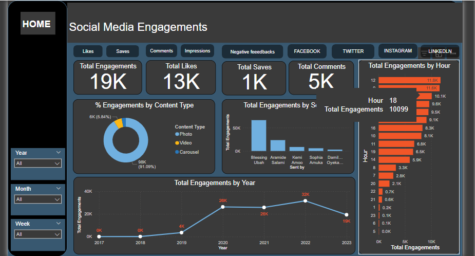
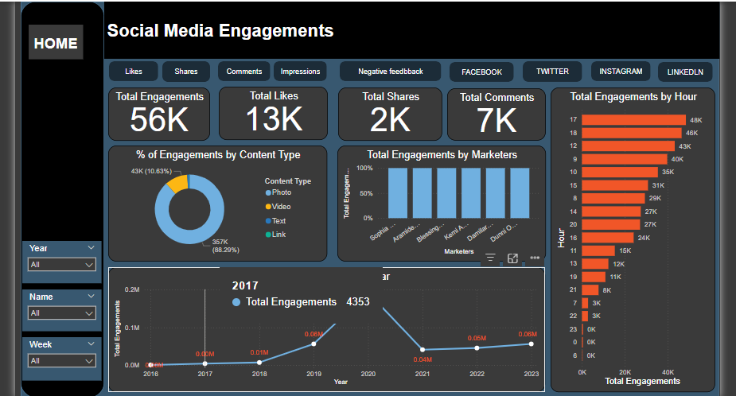
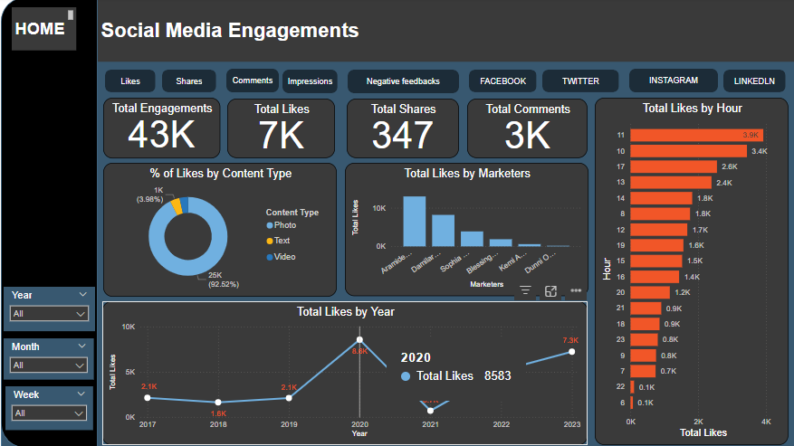
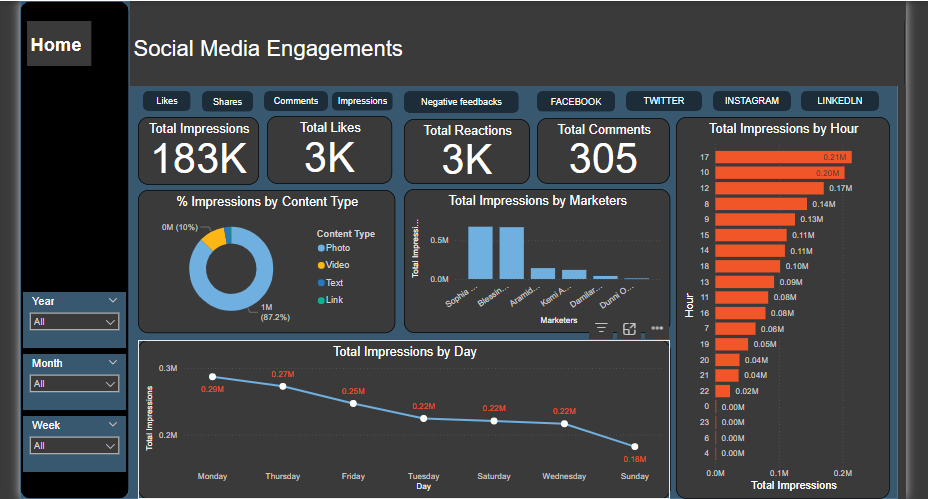

### 📊 Social Media Engagement Dashboard
This project is a comprehensive dashboard developed to track and analyze social media engagement across Facebook, LinkedIn, Twitter, and Instagram. It provides a centralized view of key metrics such as likes, shares, comments, followers, reach, and impressions, helping individuals or organizations monitor performance and optimize their social media strategies.

🔍 Key Features:
Multi-platform Integration: Aggregates data from four major platforms for a unified analysis.

Real-time Insights: Displays up-to-date engagement metrics to support timely decision-making.

User-friendly Interface: Designed with intuitive visuals for easy navigation and interpretation.

Performance Tracking: Enables trend analysis over time to identify growth patterns and content impact.

🚀 Purpose:
This dashboard serves as a tool for marketers, content creators, and analysts to streamline engagement monitoring and gain actionable insights from social media performance.

---

### 📸 Instagram Social Media Engagements

Tracks likes, comments, reach, saves, and follower changes. This section is especially useful for visual content analysis, providing insights into what resonates most with your Instagram audience.

---

### 🐦 Twitter (now X) Social Media Engagements

Monitors tweets, retweets, likes, replies, and impressions. The dashboard visualizes tweet performance and follower trends, helping identify which tweets drive the most engagement and reach.

### 📘 Facebook Social Media Engagements

The dashboard tracks engagement metrics such as post likes, shares, comments, and page reach. It helps analyze which types of content perform best and how your audience interacts with your brand on Facebook.

---

### 🔗 LinkedIn Social Media Engagements

Focuses on professional engagement, capturing metrics like post reactions, comments, shares, and follower growth. This helps measure your brand's impact and visibility in a professional context.

---

## 🔍 Summary

This Social Media Engagement Dashboard is a unified analytics tool designed to track and visualize key engagement metrics across Facebook, LinkedIn, Twitter (X), and Instagram. It provides a centralized view of likes, shares, comments, impressions, and follower growth, enabling users to assess content performance and audience interaction on each platform. Ideal for marketers, content creators, and analysts, the dashboard offers clear insights to support data-driven social media strategies.

Each visualization is designed to be intuitive and interpretable, serving both technical and non-technical stakeholders.

---
